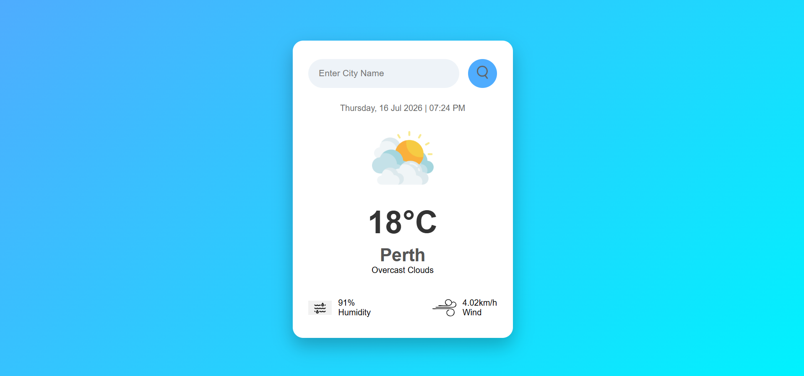
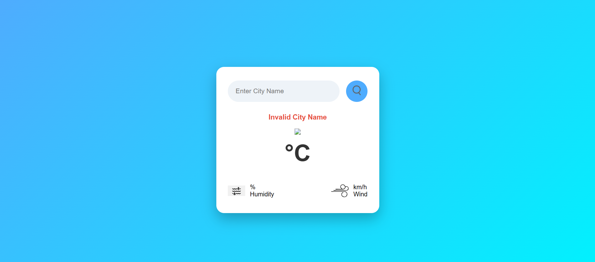

# 🌦️ Weather App

A simple weather application built using **Python**, **Django**, and the **OpenWeatherMap API**.

## Features

- Search weather by city
- Temperature
- Humidity
- Wind Speed
- Weather Description
- Local Date & Time
- Invalid City Error Handling

## Technologies Used

- Python
- Django
- HTML
- CSS
- OpenWeatherMap API

## screenshots
# home

# weather

# invalid 

## Author

**Pradeep Valavala**